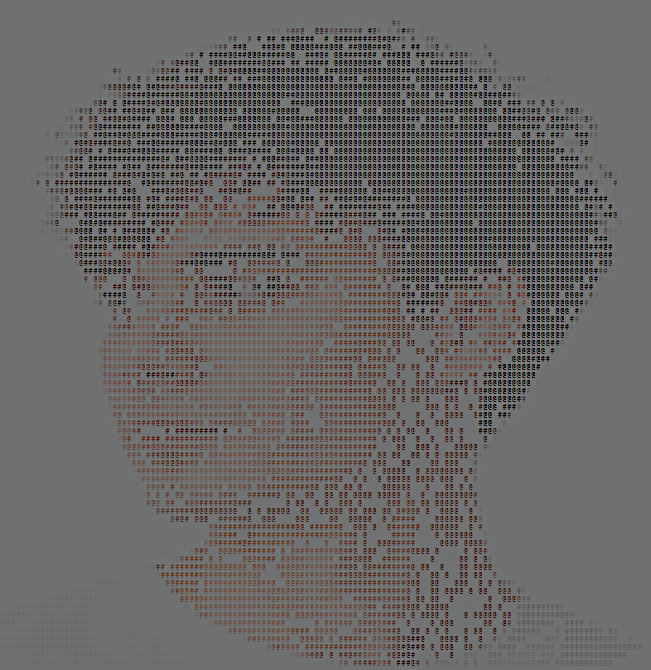

<div align="center">


<picture>
  <source media="(prefers-color-scheme: dark)" srcset="https://raw.githubusercontent.com/nikitakuvsh/nikitakuvsh/output/pacman-contribution-graph-dark.svg">
  <source media="(prefers-color-scheme: light)" srcset="https://raw.githubusercontent.com/nikitakuvsh/nikitakuvsh/output/pacman-contribution-graph.svg">
  
</picture>

</div>

<br>


<table align="center">
<tr>

<td width="100%" align="center" valign="middle">



</td>


<td width="100%" valign="middle">

```console
nikita@github:~$ whoami

Nikita Kuvshinnikov

Frontend-Focused FullStack Developer

Focused on creating modern interfaces,
scalable applications and reliable backend solutions.


nikita@github:~$ location

📍 Moscow, Russia


nikita@github:~$ technologies

✔ React
✔ TypeScript
✔ JavaScript
✔ TailwindCSS
✔ FastAPI
✔ Python
✔ PostgreSQL
✔ Docker


nikita@github:~$ current_status

🟣 Available for interesting projects

█
